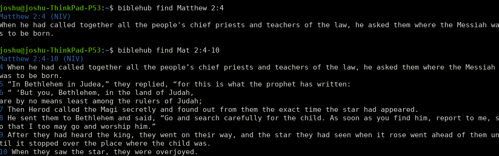
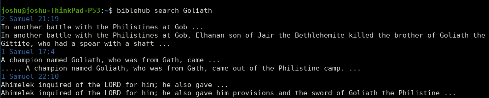

# biblehub
A python module and CLI app (Formerly BibleHubScrapper) that retrieve verses and information on those verses
from [biblehub](https://biblehub.com).
- [Installation](#installation)
- [CLI app](#cli-app)
  * [Simple Queries](#simple-queries)
  * [Informational Queries](#informational-queries)
  * [Versioning](#versioning)
  * [Search Queries](#search-queries)
- [Script Usage](#script-usage)
  * [Useful fields](#useful-fields)
  * [Searching](#searching)
- [Known Bugs](#known-bugs)
- [Contributing](#contributing)
- [Regrets](#regrets)

## Installation
```pip3 install --pre biblehub```
Currently beta testing, some bugs must be reworked.
## CLI app

### Simple Queries
Find verses with no information by using the `find` command and no flags
```bash
biblehub find Matthew 2:4
```


You can retrieve single verses, a range of verses, or an entire chapter. 

### Informational Queries
The CLI app is also capable of retrieving information on the queried single verse queries with the optional flags
`-a` (All information) `-l` (Lexicon) and `-t` (Treasury of Scripture)

*Note:* Information is only available for single verse references (i.e  *Genesis 1:1*), 
multiverse references(i.e *Genesis 1:1-2*) will not return information on 
each verse yet.

To only retrieve specific information, pass in the corresponding tag:
```shell script
biblehub find -c [Reference] # Also retrieves the cross-references
biblehub find -l [Reference] # Also retrieves the lexicon
biblehub find -t [Reference] # Also retrieves the treasury of scripture
```


As with most CLI tools, arguments can be stacked with one hyphen and the position of the arguments don't matter 
relative to the verse. All of these are valid queries:
```shell script
biblehub find -cl [Reference] # Retrieves the cross-references and lexicon in addition to the passage
biblehub find Matthew 2:4 -c
```

### Versioning
To retrieve all the versions for a single verse reference, use the `--versions` tag
```shell script
biblehub find --versions Genesis 2:4
```
To find a specific version (See available verses on [biblehub](https://biblehub.com)), use the `-v` tag
```shell script
biblehub find -v KJV Jam 4:7
```

### Search Queries
To search biblehub use the `search` command
```shell script
biblehub search Goliath
```


Contains optional arguments `--ot` and `--nt` to limit the results to the old or new testaments
## Script Usage
You can import the query and get_versions methods to use in scripts.
```python
from biblehub import find_verse, get_versions

biblehub_query = find_verse('Genesis 1:1')
all_versions = get_versions('Genesis 1:1')
print(biblehub_query.text) # In the beginning...
print(all_versions[0].passage)
```
By default, it will query all possible fields.
You can choose not to query certain fields by indicating in the parameters
for example:
` find_verse('Genesis 1:1', get_lexicons=False) `

### Useful fields
```python
print(biblehub_query.passage) # Genesis 1:1
print(biblehub_query.version) # NIV (default)
print(biblehub_query.lexicons) # Text, Hebrew words, translit, strong, and English defintions
print(biblehub_query.crfs) # Cross References
print(biblehub_query.tos) # Treasury of Scripture
print(biblehub_query.info) # Prints all the info queried on the verse. Also the same as the __str__
```
there are also `biblehub_query.format_[field]` method that returns the specified field in an easy to read way.
### Searching
```python
from biblehub import search as b_search
list = b_search("Goliath", filter='nt')
```
## Known Bugs
- Because of the way psalms are formatted in biblehub, if you do a multi-verse query for the psalms (i.e Psalms 23:1-5),
parts of the verses will be cut off. This problem is not present in single verse queries however
- If you type in a random version (i.e `biblehub -v JOE Matthew 2:4`) it will retrieve the NIV by default as expected,
but the version in the reference display will still display that unknown version. This can make for some pretty fun
images though.
## Contributing
If you feel like improving the codebase, adding a feature, or checking my grammar, feel free!
checkout the issues I post for tasks you can help with, reference specific issues when making a PR.
Make sure to send a pull request against the development branch.

## Regrets
This was probably one of the most fun side projects I have worked on, sadly though I am unlikely to continue developing
it. I did not begin this with the goal of making it a sustainable project, I only wanted to hash together something to
help me whenever I needed to quickly lookup bible references or look at cross-references. For this reason, I did not
develop tests earlier on and did not spend a lot of time on making the codebase scalable for different uses. I say
all of this just to make this statement:
### WRITE TESTS!!! They make life so much easier in the long term

Find this app helpful? Useful? Please let me know at [joshua@joshpetit.dev](joshua@joshpetit.dev)!